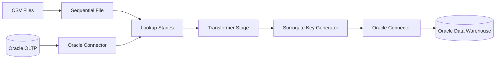

# Airline DWH Analytics Platform
**An ETL Pipeline using IBM DataStage**

An ETL system for an airline platform. The system ingests data from heterogeneous sources (flat files and operational RDBMS), applies deterministic business transformations, generates surrogate keys, and loads cleansed and enriched records into a Star Schema Data Warehouse to empower business decisions across flight activity, frequent flyer programs, reservations, and customer care interactions.

---

## 📑 Table of Contents
- [Architecture](#architecture)
- [Pipeline Flow](#pipeline-flow)
- [Project Features](#project-features)
- [Project Structure](#project-structure)
- [Key Components](#key-components)
- [Data Model](#data-model)
- [DimPassenger (SCD Type 2)](#dimpassenger-scd-type-2)
- [Technology Stack](#technology-stack)
- [Getting Started](#getting-started)
- [Team](#team)

---

## 🏗️ Architecture
The ETL pipeline is implemented using IBM InfoSphere DataStage. The system consists of multiple IBM DataStage jobs that share a centralized processing core responsible for data ingestion, surrogate key generation, dimension lookups, business transformations, and data warehouse loading.

---

## ⚙️ Pipeline Flow
Each dataset passes through a deterministic ETL workflow. The pipeline guarantees that only enriched, de-duplicated, and validated records reach the Fact Tables.



## ⭐ Project Features

- Multi-source ETL (CSV + Oracle)
- Star Schema Data Warehouse
- Slowly Changing Dimensions (SCD)
- Surrogate Key Generation
- Oracle Connectors
- Lookup Stages
- Fact Loading

## 📂 Project Structure 
This structure reflects the actual organization of the project, separating DataStage jobs, parameter sets, OLAP/OLTP scripts, and documentation.

```text
airline-datastage_pipeline/
│
├── DataStage/                              # DataStage dimension jobs
│   └── DimJobs/                            # All dimension load jobs (.dsx)
│       ├── BookingChannelDimJob.dsx
│       ├── DimAircraft.dsx
│       ├── DimAirport.dsx
│       ├── DimPassenger.dsx
│       ├── DimTier.dsx
│       ├── Export.dsx
│       ├── FlightsDimJob.dsx
│       ├── PromotionsDimJob.dsx
│       ├── dim_fare_class.dsx
│       └── dim_routes.dsx
│
├── FactJobs/                              # All fact load jobs (.dsx)
│   ├── FactCustomerInteraction...
│   ├── FactFlightUpgrade.dsx
│   ├── FactLoyalty.dsx
│   ├── FactOvernightStayJob.dsx
│   ├── FactPayment.dsx
│   ├── FactPromotionResponses...
│   ├── FactFlightCost.dsx
│   ├── FactReservations.dsx
│   └── FactTicket.dsx
│
├── ParametersSets/                         # Parameter set definitions
│   └── OracleParameters.dsx
│
├── OLAP/                                   # Data Warehouse DDL & scripts
│   ├── Create_Dimensions.sql
│   ├── Create_Facts.sql
│   ├── Date_Insertion.sql
│   ├── Fact_FlightCost.sql
│   ├── Fact_Reservations.sql
│   └── Fact_Ticket.sql
│
├── OLTP/                                   # Source system DDL & data scripts
│   ├── Create_OLTP_Tables.sql
│   ├── Create_upgrade_flights_tabl...
│   ├── Indexes.sql
│   ├── Insert_OLTP_Data.sql
│   ├── create TRANSACTIONS tabl...
│   └── marketing_response_oracle...
│
└── README.md
```

## 📊 Data Model

```mermaid
erDiagram
    DimPassenger {
        int Passenger_Key PK
        int Passenger_ID
        varchar First_Name
        varchar Last_Name
        varchar Gender
        date Date_Of_Birth
        varchar Nationality
        varchar Passport_Number
        varchar Email
        varchar Phone
        varchar FF_Number
        varchar Tier_Name
        int Total_Miles
        date Join_Date
        date Effective_Date
        date Expiry_Date
        char Current_Flag
    }

    DimFlight {
        int Flight_Key PK
        int Flight_ID
        varchar Flight_Number
        int Route_ID FK
        int Aircraft_ID
        varchar Status
    }

    DimRoute {
        int Route_Key PK
        int Route_ID
        int Origin_Airport_ID FK
        int Destination_Airport_ID FK
        int Distance_KM
        int Flight_Duration_Min
        char Is_International
    }

    DimAirport {
        int Airport_Key PK
        int Airport_ID
        varchar IATA_Code
        varchar Airport_Name
        varchar City
        varchar Country
        varchar Timezone
    }

    DimAircraft {
        int Aircraft_Key PK
        int Aircraft_ID
        varchar Tail_Number
        varchar Model
        varchar Manufacturer
    }

    DimFareClass {
        int Fare_Key PK
        int Fare_Class_ID
        varchar Fare_Code
        varchar Fare_Description
        varchar Cabin
        char Refundable
        decimal Miles_Multiplier
    }

    DimBookingChannel {
        int Channel_Key PK
        int Channel_ID
        varchar Channel_Name
        varchar Channel_Type
        char Is_Online
    }

    DimPromotion {
        int Promotion_Key PK
        int Promo_ID
        varchar Promo_Code
        varchar Promo_Name
        decimal Discount_Pct
        int Miles_Bonus
        date Start_Date
        date End_Date
        int Route_id
        char Is_Active
    }

    DimDate {
        int Date_Key PK
        date Full_Date
        int Day
        int Month
        int Quarter
        int Year
    }

    FactReservation {
        int Reservation_Key PK
        int Passenger_Key FK
        int Flight_Key FK
        int Fare_Key FK
        int Channel_Key FK
        int Promotion_Key FK
        int Booking_Date_Key FK
        int Departure_Date_Key FK
        int Arrival_Date_Key FK
        int Reservation_ID
        varchar Seat_Number
        varchar Payment_Method
        decimal Amount_Paid
        int Miles_Earned
        int Miles_Redeemed
        char Is_Upgrade
        varchar Reservation_Status
    }

    FactTicket {
        int Ticket_Key PK
        int Passenger_Key FK
        int Flight_Key FK
        int Fare_Key FK
        int Date_Key FK
        int Ticket_ID
        int Reservation_ID
        varchar Ticket_Number
        varchar Seat_Number
        decimal Base_Fare_USD
        decimal Tax_Amount_USD
        decimal Fee_Amount_USD
        decimal Discount_Amount_USD
        decimal Final_Ticket_Amount_USD
        varchar Ticket_Status
        int Miles_Earned
        int Miles_Redeemed
    }

    FactPayment {
        int Payment_Key PK
        int Passenger_Key FK
        int Channel_Key FK
        int Date_Key FK
        int Payment_ID
        int Reservation_ID
        varchar Payment_Method
        decimal Payment_Amount_USD
        varchar Payment_Status
        varchar Currency_Code
        varchar Transaction_Reference
    }

    FactFlightCosts {
        int Flight_Cost_Key PK
        int Flight_Key FK
        int Aircraft_Key FK
        int Date_Key FK
        int Flight_Cost_ID
        decimal Fuel_Cost_USD
        decimal Crew_Cost_USD
        decimal Airport_Fees_USD
        decimal Maintenance_Cost_USD
        decimal Catering_Cost_USD
        decimal Total_Cost_USD
    }

    FactLoyalty {
        int Loyalty_Key PK
        int Passenger_Key FK
        int Date_Key FK
        int Transaction_ID
        int Reservation_ID
        varchar Transaction_Type
        int Miles_Amount
        varchar Source_System
    }

    FactPromotionResponse {
        int Response_Key PK
        int Passenger_Key FK
        int Promotion_Key FK
        int Date_Key FK
        int Channel_Key FK
        int Response_ID
        char Opened_Flag
        char Clicked_Flag
        char Booked_Flag
    }

    FactFlightUpgrade {
        int Upgrade_Key PK
        int Passenger_Key FK
        int Flight_Key FK
        int Date_Key FK
        int Channel_Key FK
        int Upgrade_ID
        int Reservation_ID
        varchar From_Class
        varchar To_Class
        varchar Upgrade_Type
        int Miles_Used
        decimal Amount_Paid
        varchar Upgrade_Status
    }

    FactOvernightStay {
        int Stay_Key PK
        int Passenger_Key FK
        int Date_Key FK
        int Stay_ID
        int Reservation_ID
        int Check_In_Date_Key FK
        int Check_Out_Date_Key FK
        varchar Hotel_Name
        varchar City
        varchar Country
        int Nights
        varchar Room_Type
        decimal Nightly_Rate_USD
        char Paid_By_Airline
    }

    FactCustomerInteraction {
        int Interaction_Key PK
        int Passenger_Key FK
        int Date_Key FK
        int Interaction_ID
        int Reservation_ID
        varchar Interaction_Type
        varchar Channel
        varchar Issue_Category
        varchar Severity
        varchar Resolution_Status
        decimal CSAT_Score
    }

    %% ====== FACT → DIMENSION RELATIONSHIPS ======
    FactReservation }o--|| DimPassenger : "Passenger_Key"
    FactReservation }o--|| DimFlight : "Flight_Key"
    FactReservation }o--|| DimFareClass : "Fare_Key"
    FactReservation }o--|| DimBookingChannel : "Channel_Key"
    FactReservation }o--|| DimPromotion : "Promotion_Key"
    FactReservation }o--|| DimDate : "Booking_Date_Key"
    FactReservation }o--|| DimDate : "Departure_Date_Key"
    FactReservation }o--|| DimDate : "Arrival_Date_Key"

    FactTicket }o--|| DimPassenger : "Passenger_Key"
    FactTicket }o--|| DimFlight : "Flight_Key"
    FactTicket }o--|| DimFareClass : "Fare_Key"
    FactTicket }o--|| DimDate : "Date_Key"

    FactPayment }o--|| DimPassenger : "Passenger_Key"
    FactPayment }o--|| DimBookingChannel : "Channel_Key"
    FactPayment }o--|| DimDate : "Date_Key"

    FactFlightCosts }o--|| DimFlight : "Flight_Key"
    FactFlightCosts }o--|| DimAircraft : "Aircraft_Key"
    FactFlightCosts }o--|| DimDate : "Date_Key"

    FactLoyalty }o--|| DimPassenger : "Passenger_Key"
    FactLoyalty }o--|| DimDate : "Date_Key"

    FactPromotionResponse }o--|| DimPassenger : "Passenger_Key"
    FactPromotionResponse }o--|| DimPromotion : "Promotion_Key"
    FactPromotionResponse }o--|| DimBookingChannel : "Channel_Key"
    FactPromotionResponse }o--|| DimDate : "Date_Key"

    FactFlightUpgrade }o--|| DimPassenger : "Passenger_Key"
    FactFlightUpgrade }o--|| DimFlight : "Flight_Key"
    FactFlightUpgrade }o--|| DimBookingChannel : "Channel_Key"
    FactFlightUpgrade }o--|| DimDate : "Date_Key"

    FactOvernightStay }o--|| DimPassenger : "Passenger_Key"
    FactOvernightStay }o--|| DimDate : "Check_In_Date_Key"
    FactOvernightStay }o--|| DimDate : "Check_Out_Date_Key"

    FactCustomerInteraction }o--|| DimPassenger : "Passenger_Key"
    FactCustomerInteraction }o--|| DimDate : "Date_Key"

    %% ====== DIMENSION → DIMENSION RELATIONSHIPS ======
    DimFlight }o--|| DimRoute : "Route_ID"
    DimRoute }o--|| DimAirport : "Origin_Airport_ID"
    DimRoute }o--|| DimAirport : "Destination_Airport_ID"
```

<details>
<summary><strong>View ER Diagram</strong></summary>


## Slowly Changing Dimension (SCD Type 2)

The `DimPassenger` dimension is implemented using the SCD Type 2 methodology.

For more details, see:

➡️ [SCD Type 2 Documentation](SCD_Type2.md)

## 🧩 Key Components

1. Ingestion Layer

- Sequential File stages ingest CSV files, while Oracle Connector stages read operational data  directly from Oracle databases. 

2. Validation & Cleansing

- Null checks on mandatory fields.
- Referential integrity validation using Lookup stages.
- Data type conversion.
- Business rule validation.

3. Surrogate Key Generator

- This stage generates numeric surrogate keys (e.g., the Surrogate Key column) for both dimensions and facts. It persists the last generated value in a State File (e.g., DIM_BOOKING_CHANNEL.state) to ensure sequential consistency even after server restarts.

4. Transformation Layer (Business Logic)

- Business transformations are implemented using Transformer stages, including column mapping, derived attributes, data type conversion, conditional logic, and business rule implementation.

5. Loading Layer (DWH Loader)

- The final loading phase uses Oracle Connector stages to populate the Star Schema Data Warehouse after all transformations and lookups are completed.

| Business Process | Fact Tables | Purpose |
|------------------|------------|---------|
| Flight Activity | FactTicket, FactFlightUpgrade, FactOvernightStay, FactFlightCost | Analyze flight operations, upgrades, overnight stays, and costs. |
| Loyalty | FactLoyalty, FactPromotionResponses | Analyze loyalty program activity and promotions. |
| Reservations | FactReservations, FactPayment | Analyze bookings and payments. |
| Customer Care | FactCustomerInteraction | Analyze customer interactions and satisfaction. |

- Indexes & Partitions:
A robust indexing strategy is implemented to accelerate lookups:
    - IDX_FACT_TICKET_PASSENGER & IDX_RES_PASSENGER: Accelerate passenger joins.
    - IDX_FACT_TICKET_DATE & IDX_RES_BOOKDATE: Accelerate time-based queries.

## 💻 Technology Stack

| Component | Technology | Purpose |
|-----------|------------|---------|
| ETL Tool | IBM InfoSphere DataStage 9.1 | Enterprise ETL development |
| Database | Oracle Database | Data Warehouse |
| Data Sources | CSV Files, Oracle OLTP | Source systems |
| SQL | Oracle SQL | DDL & ETL Queries |
| Version Control | Git & GitHub | Source code management |


## 🚀 Getting Started

### Prerequisites
Access to an IBM DataStage Server (Version 9.1 or later).

### Installation & Run
Clone the Repository:

```bash
git clone https://github.com/mariam-tahaa/Airline_Datastage_Pipeline
```

Import the DataStage Jobs:
Use the DataStage Client (Designer) to import the .dsx files from the DataStage/ and FactJobs/ folders.

## 👥 Team

Developed as part of the **ITI Data Management Track**.

- Shahd Hamdi
- Salma Algayar
- Mariam Taha
