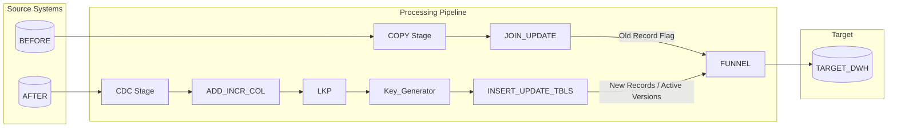

## DimPassenger (SCD Type 2)

This document provides a comprehensive overview of the IBM InfoSphere DataStage parallel job used to populate and maintain the **DimPassenger** dimension table using a **Slowly Changing Dimension Type 2 (SCD Type 2)** strategy.

---

## Job Overview

The primary objective of this job is to capture historical changes in passenger details (such as tier level, phone number, or email) over time.

Whenever an existing passenger record changes:

1. The current record is **expired**.
2. A **new version** of the record is inserted with the updated attributes.
3. The complete history of the passenger is preserved.

This implementation follows the standard **SCD Type 2** methodology.

---

## Target Table Schema (DimPassenger)

| Column | Description |
|---------|-------------|
| **Passenger_Key** | Surrogate key (Primary Key). A new key is generated for every record version. |
| **Passenger_ID** | Business key identifying the passenger across source systems. |
| **Effective_Date** | Date on which this version became active. |
| **Expiry_Date** | Date on which this version expired (`9999-12-31` while active). |
| **Current_Flag** | Indicates whether the record is active (`Y`) or expired (`N`). |

---

## Data Flow Architecture

The ETL flow consists of four major phases:

1. Change Detection
2. SCD Metadata Enrichment
3. Action Splitting
4. Target Merge & Load

---

## Component Breakdown

### 1. Data Ingestion & Replication

#### BEFORE (Database Connector)

Reads the historical (existing) passenger records from the Data Warehouse before the current load begins.

---

#### AFTER (Database Connector)

Reads the latest passenger snapshot containing newly arrived or modified records.

---

#### COPY (Copy Stage)

Duplicates the **BEFORE** stream into two branches.

- **BEFORE1**
  - Sent to the Change Data Capture stage.

- **BEFORE2**
  - Preserved for later use when expiring previous record versions.

---

### 2. Change Data Capture & Enrichment

#### CDC (Change Data Capture Stage)

Compares **BEFORE1** and **AFTER** using the business key:

- `Passenger_ID`

The stage classifies records into actions such as:

- Insert
- Update (Edit)

Only changed or new rows continue through the pipeline.

---

#### ADD_INCR_COL (Transformer Stage)

Adds SCD-related metadata to incoming rows.

Typical values assigned include:

- Effective_Date = current batch date
- Current_Flag = `Y`
- Expiry_Date = `9999-12-31`

These values prepare the records for insertion as active dimension members.

---

#### MAX_SK & LKP (Lookup Stage)

Retrieves the current maximum surrogate key (`MAX_SK`) from **DimPassenger**.

This value serves as the starting point for generating new surrogate keys.

---

### 3. Key Generation & Record Processing

#### Key_Generator (Surrogate Key Generator Stage)

Generates new surrogate keys beginning immediately after `MAX_SK`.

This guarantees:

- Unique Passenger_Key values
- No primary key collisions
- Continuous surrogate key sequence

---

#### INSERT_UPDATE_TBLS (Transformer Stage)

Acts as the main routing logic.

##### INSERT Stream

Contains:

- Brand-new passengers
- New versions of modified passengers

These records are prepared with:

- Current_Flag = `Y`
- Expiry_Date = `9999-12-31`

---

##### UPDATE Stream

Contains the identifiers of existing records that must be expired.

These rows proceed to the update path.

---

### 4. Expiring History & Target Loading

#### JOIN_UPDATE (Join Stage)

Joins the UPDATE stream with the preserved **BEFORE2** records.

This allows the job to locate the currently active version and update it by:

- Setting `Current_Flag = 'N'`
- Updating `Expiry_Date` to the current batch date

The previous version is therefore marked as historical.

---

#### FUNNEL_INSERT_UPDATE (Funnel Stage)

Combines:

- INSERT stream (new active versions)
- UPDATE stream (expired historical versions)

into one unified output stream.

---

#### TARGET_DWH (Database Connector)

Loads the final dataset into the Data Warehouse.

The connector performs:

- Inserts for new active records
- Updates for expired historical records

ensuring the dimension always contains:

- One current version (`Current_Flag = 'Y'`)
- Zero or more historical versions (`Current_Flag = 'N'`)

for every passenger.

---

## SCD Type 2 Lifecycle Example

Suppose the following passenger already exists:

| Passenger_Key | Passenger_ID | Tier | Current_Flag | Effective_Date | Expiry_Date |
|---------------|--------------|------|--------------|----------------|-------------|
| 101 | P1001 | Silver | Y | 2025-01-01 | 9999-12-31 |

Later, the passenger is upgraded to **Gold**.

The ETL performs two operations:

#### Step 1 – Expire Existing Record

| Passenger_Key | Passenger_ID | Tier | Current_Flag | Effective_Date | Expiry_Date |
|---------------|--------------|------|--------------|----------------|-------------|
| 101 | P1001 | Silver | N | 2025-01-01 | 2025-07-10 |

#### Step 2 – Insert New Active Version

| Passenger_Key | Passenger_ID | Tier | Current_Flag | Effective_Date | Expiry_Date |
|---------------|--------------|------|--------------|----------------|-------------|
| 102 | P1001 | Gold | Y | 2025-07-10 | 9999-12-31 |

This preserves the passenger's complete history while ensuring only one record remains active.

--
## Summary

The DataStage job implements a standard Slowly Changing Dimension Type 2 pipeline by:

Detecting new and modified passengers
Assigning SCD metadata
Generating new surrogate keys
Expiring previous versions
Inserting new active versions
Maintaining a complete historical record of passenger attribute changes